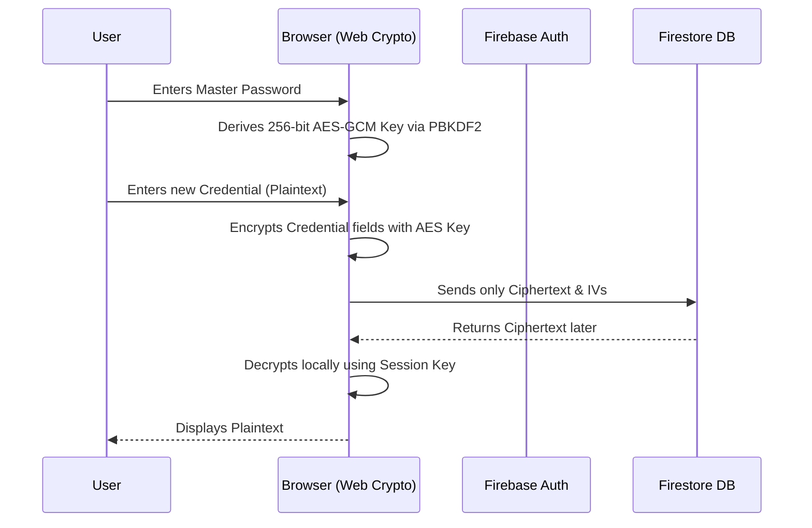

# 🔒 Zero-Knowledge Password Vault

    

> A production-hardened, zero-knowledge personal password manager. **Your keys, your data.**

---

<details>
<summary><b>📚 Table of Contents (Click to expand)</b></summary>

1. [Architectural Deep Dive](#-architectural-deep-dive)
2. [Security & Zero-Knowledge Guarantees](#-security--zero-knowledge-guarantees)
3. [Key Features](#-key-features)
4. [Tech Stack](#-tech-stack)
5. [Local Development Guide](#-local-development-guide)
6. [Comprehensive Testing](#-comprehensive-testing)
7. [Production Deployment](#-production-deployment)
</details>

---

## 🏛 Architectural Deep Dive

This application does not rely on a backend to perform encryption. Instead, it turns your web browser into an isolated cryptographic engine using the native `Web Crypto API`.

### 🔄 The Zero-Knowledge Flow



<details>
<summary><b>🔍 How we prevent Master Password leaks (Click to reveal)</b></summary>
<br/>
The master password is never stored in <code>localStorage</code>, <code>sessionStorage</code>, cookies, or variables that survive page reloads. It is converted directly into an ephemeral <code>CryptoKey</code> object configured with <code>extractable: false</code>. This means that even if a malicious browser extension executes code on the page, it cannot export or extract the raw cryptographic bytes from your system's RAM.
</details>

---

## 🛡 Security & Zero-Knowledge Guarantees

We built this vault specifically to defend against common modern attack vectors:

- **Data Breach Immunity:** Even if a malicious actor successfully dumps the entire Firestore database, they receive only mathematically unreadable AES-GCM ciphertexts without the keys to decrypt them.
- **Tamper Resistance (AEAD):** AES-GCM provides Authenticated Encryption with Associated Data. If a ciphertext or Initialization Vector (IV) is modified in transit, the Web Crypto API violently rejects the decryption attempt, preventing chosen-ciphertext attacks.
- **Production Hardening (SWC & Headers):**
  - **No Console Leaks:** The Next.js SWC compiler physically strips all `console.log` statements in the production build to prevent plaintext credentials from dumping to the browser inspector.
  - **Clickjacking & XSS Defense:** Locked down with strict `Content-Security-Policy`, `X-Frame-Options: DENY`, and `Strict-Transport-Security`.
- **Crawler Blocking:** Hardcoded `robots.txt` and `<meta name="robots">` to enforce `noindex, nofollow` worldwide.

---

## ✨ Key Features

- **🔐 100% Client-Side Encryption:** No server-side decryption algorithms. Everything happens in your local CPU.
- **🔑 Cryptographically Secure Password Generator:** Built-in module utilizing `crypto.getRandomValues()` to generate high-entropy passwords with custom character sets (while filtering ambiguous characters).
- **🔄 Master Password Rotation:** Automatically batch-re-encrypts your entire vault locally if you choose to rotate your master key.
- **🗃️ Intelligent Organization:** Real-time, case-insensitive substring searching and automatic tag extraction/deduplication.
- **♿ Fully Accessible UI:** Features an invisible `A11yAnnouncer` bus for screen readers, ensuring dynamic state changes (like "Vault Unlocked") are correctly narrated to visually impaired users.

---

## 🛠 Tech Stack

| Domain | Technology | Description |
|--------|------------|-------------|
| **Core Framework** | Next.js 16 (App Router) | React Server Components & Turbopack |
| **Styling** | Tailwind CSS v4 & shadcn/ui | Radix primitives for an accessible component library |
| **Database & Auth** | Firebase | Client-side SDK for Firestore and Authentication |
| **Cryptography** | Web Crypto API | Native browser execution of PBKDF2-SHA256 & AES-GCM |
| **Validation** | Zod & React Hook Form | Headless, strict schema typing and URL sanitization |

---

## 🚀 Local Development Guide

### 1. Repository Setup
```bash
git clone https://github.com/habibulhaasan/password-vault.git
cd password-vault
npm install
```

### 2. Firebase Orchestration
1. Create a project via the [Firebase Console](https://console.firebase.google.com/).
2. Enable **Firestore Database** and **Authentication** (Email/Password).
3. Connect your CLI and deploy the strict security rules:
   ```bash
   firebase login
   firebase use --add
   npx firebase-tools deploy --only firestore
   ```
4. Copy the environment variables:
   ```bash
   cp .env.example .env.local
   ```
5. Populate `.env.local` with your web app keys.

### 3. Launch Development Server
```bash
npm run dev
```

---

## 🧪 Comprehensive Testing

The vault's security invariants are continually verified via Node's native test runner (`node:test`). We execute **75 distinct assertions** covering:
- PBKDF2 Salt Uniqueness & AES-GCM IV Unpredictability
- Error Sanitization (Masking Google API Keys & JWTs from UI errors)
- Zod schema validation edge cases (rejecting `javascript:` protocols)
- Firestore Security Rules static regex inspection

**Run the suite:**
```bash
npm test
```

---

## 🌐 Production Deployment (Vercel)

1. Import this repository into your Vercel Dashboard.
2. In the "Environment Variables" step, paste your 6 `NEXT_PUBLIC_FIREBASE_*` keys from `.env.example`.
3. Deploy.
4. **CRITICAL:** Take your new Vercel domain (e.g. `your-vault.vercel.app`) and add it to the **Authorized Domains** list in the Firebase Authentication console. Google will reject authentication attempts otherwise.

---

<div align="center">
  <i>Built with strictly enforced zero-knowledge principles. Use responsibly.</i>
</div>
